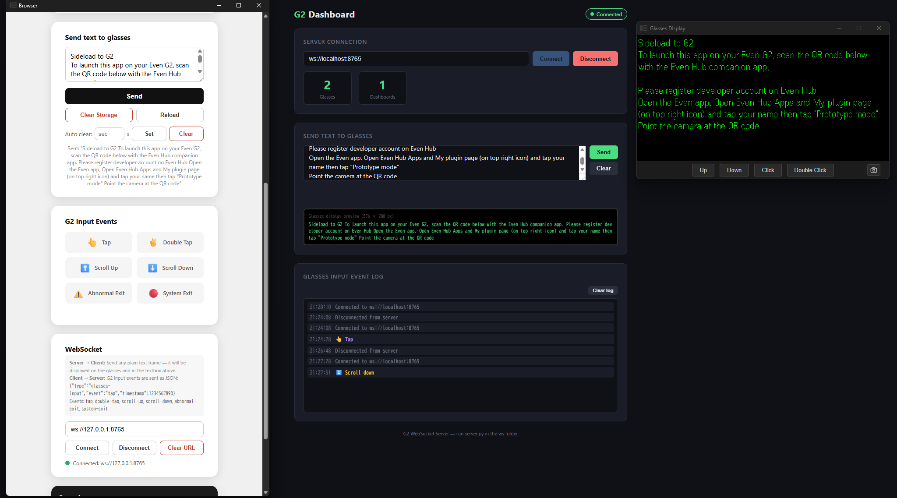

# g2_helloworld

**A sideload app demo for Even Realities G2 smart glasses**

**Author:** gpsnmeajp  
**License:** Unlicense

Demo(QR Code): https://sabowl.sakura.ne.jp/g2/helloworld/

Ref: https://zenn.dev/gpsnmeajp/scraps/beb45043a2d731



---

## Purpose

- **Working demo** of a G2 glasses app
- **Sideload app demo** deployable to any web server
- **Beginner sample** for getting started with the Even Hub SDK
- **Quick way to display arbitrary text** on the G2 display for rapid testing

---

## Features

- **Auto-generated QR code** — Opens with a QR code of its own URL. Scan it from the Even Hub companion app to sideload instantly
- **Text sender** — Send any text from the Web UI to the G2 display (throttled to a minimum 2-second interval)
- **Last input restore** — Saves the last sent text to SDK storage and re-displays it automatically on next launch
- **Auto-clear timer** — Optionally clears the glasses display (overwrites with a space) after a configurable number of seconds. Timer resets on every send. Delay is persisted in SDK storage and restored on next launch
- **WebSocket client** — Connect to a WebSocket server to remotely push text to the glasses and receive G2 input events as JSON. URL is saved to SDK storage and auto-connected on next launch. Reconnects with exponential backoff on failure
- **Input event visualizer** — Tap, double-tap, scroll up/down, abnormal exit, and system exit events are shown in real time on the Web UI
- **In-WebView console** — `console.log` / `.warn` / `.error` output is captured and shown in the browser panel for on-device debugging
- **Storage controls** — **Clear Storage** wipes the persisted text from SDK storage; **Reload** refreshes the page

---

## Requirements

- [Even Realities G2 smart glasses](https://www.evenrealities.com/)
- Even app (iOS / Android)
- [Even Hub **developer account**](https://hub.evenrealities.com/)
- Node.js 18+
- PC and glasses on the **same Wi-Fi network**

---

## Setup

```bash
npm install
```

---

## Development

```bash
npm run dev
```

Vite starts a server at `http://localhost:5173` (or the next available port).

Open `http://<your LAN IP>:5173` in a browser to see the QR code, then scan it with the Even Hub app to sideload.

---

## Build

```bash
npm run build
```

Output goes to `dist/`. Deploy it to any static web server.

Base url config in package.json

`"build": "tsc && vite build --base=/g2/helloworld/",`

---

## Sideload Steps

1. Register a developer account on Even Hub
2. Open the Even Hub app → tap the top-right icon → **My plugin** → tap your name → enable **Prototype mode**
3. Run `npm run dev`
4. Open `http://<your LAN IP>:5173` in a browser
5. Scan the displayed QR code with the Even Hub app

---

## Usage

| Action | Result |
|---|---|
| Type in the textarea → **Ctrl+Enter** | Send text to the G2 display |
| **Enter** | New line in the textarea |
| Enter seconds → **Set** (Auto clear) | Glasses display is overwritten with a space after the specified time |
| **Clear** (Auto clear) | Disable the auto-clear timer |
| Enter a `ws://` URL → **Connect** | Connect to a WebSocket server for remote text push and event forwarding |
| **Disconnect** | Disconnect from the WebSocket server |
| **Clear URL** (WebSocket) | Disconnect and remove the saved URL from SDK storage |
| Operate the glasses touchpad | Shown in real time on the event monitor |
| **Clear Storage** button | Wipes the saved text from SDK storage |
| **Reload** button | Reloads the page |

---

## WebSocket API

| Direction | Format | Description |
|---|---|---|
| Server → Client | Plain text frame | Displayed on the glasses and filled into the textarea. Subject to the same 2-second throttle as manual sends |
| Client → Server | JSON | Sent on connection open: `{"type":"connect","timestamp":1234567890}` |
| Client → Server | JSON | G2 input events: `{"type":"glasses-input","event":"tap","timestamp":1234567890}` |

Event names: `tap`, `double-tap`, `scroll-up`, `scroll-down`, `abnormal-exit`, `system-exit`

### WebSocket Connection Restrictions

| Deployment method | Restriction |
|---|---|
| **QR Code Sideload** (`npm run dev` / static server) | No restriction — any `ws://` or `wss://` URL can be used |
| **Even Hub upload** | Connection target must be either (a) `localhost` (on-device, within the smartphone) or (b) a domain **exactly** declared in `app.json` |

When publishing to Even Hub, add an allowed domain to `app.json` like the example below.  
The domain must be an **exact match** (wildcards are not supported):

> **Note:** If the `permissions` array does not include the target domain, the WebSocket connection will be silently blocked by Even Hub at runtime.

---

## WebSocket Server (`ws/`)

A lightweight Python WebSocket server that bridges the G2 glasses and a browser-based Dashboard.

### Requirements

- Python 3.10+
- `pip install -r ws/requirements.txt` (`websockets >= 12.0`)

### Start

```bash
cd ws
pip install -r requirements.txt
python server.py
```

| Endpoint | Address | Description |
|---|---|---|
| WebSocket | `ws://0.0.0.0:8765` | G2 glasses and Dashboard connect here |
| HTTP / Dashboard UI | `http://0.0.0.0:8080/index.html` | Open in any browser |

### Server Protocol

| Direction | Format | Description |
|---|---|---|
| Glasses → Server | JSON | `{"type":"connect","timestamp":1234567890}` — sent on WebSocket open; registers the client as a glasses device |
| Glasses → Server | JSON | `{"type":"glasses-input","event":"tap","timestamp":1234567890}` — touchpad / lifecycle events |
| Server → Glasses | Plain text | Displayed on the glasses display |
| Dashboard → Server | JSON | `{"type":"register"}` — register as Dashboard |
| Dashboard → Server | JSON | `{"type":"send-text","text":"Hello"}` — push text to all glasses |
| Server → Dashboard | JSON | glasses-input events forwarded as-is |
| Server → Dashboard | JSON | `{"type":"status","glasses":1,"dashboards":1}` — live connection counts |
| Server → Dashboard | JSON | `{"type":"send-ack","text":"Hello","sent_to":1}` — delivery confirmation |

### Dashboard UI Features

- Connect / disconnect from the Python server
- Live counter of connected glasses and Dashboard clients
- Send arbitrary text to all connected glasses (Ctrl+Enter shortcut)
- Glasses display preview showing the last sent text
- Real-time glasses input event log (tap, double-tap, scroll-up, scroll-down, etc.)

---

## Project Structure

```
g2_helloworld/
  app.json          Even Hub app manifest
  index.html        QR code, text sender, and event monitor UI
  src/
    main.ts         Even Hub SDK integration and glasses-side logic
  ws/
    server.py       Python WebSocket + HTTP server
    index.html      Dashboard UI (served by server.py)
    requirements.txt
  package.json
  tsconfig.json
```

---

## Tech Stack

- [Vite](https://vite.dev/) + TypeScript
- [@evenrealities/even_hub_sdk](https://www.npmjs.com/package/@evenrealities/even_hub_sdk)
- [@evenrealities/evenhub-cli](https://www.npmjs.com/package/@evenrealities/evenhub-cli)
- [@evenrealities/evenhub-simulator](https://www.npmjs.com/package/@evenrealities/evenhub-simulator)
- Python + [websockets](https://websockets.readthedocs.io/) (server only)
